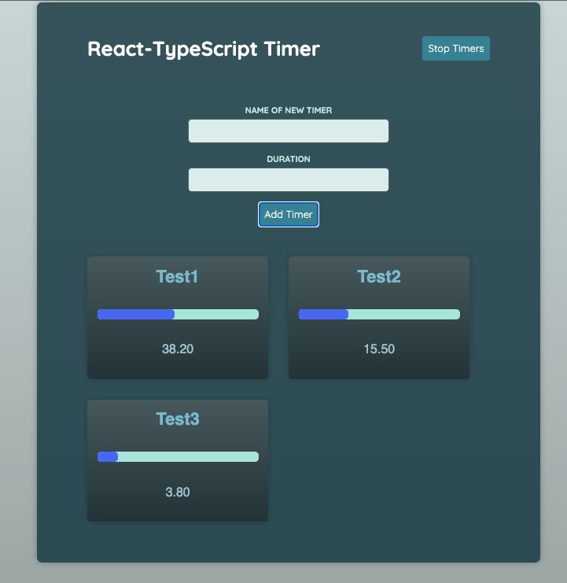

# react-typescript-timer-app

> Practice project, as instructed by [Maximillian Schwarzmüller](https://www.udemy.com/user/maximilian-schwarzmuller/).

Built with ReactJS (@vite), and Typescript.

To run the project in development:

0. Make sure, `node` is installed
1. Clone the project
2. Install all packages: `npm install`
3. Run dev server: `npm run dev`

> Credit for styles, starting code and coding instructions: [Maximillian Schwarzmüller](https://www.udemy.com/user/maximilian-schwarzmuller/)
